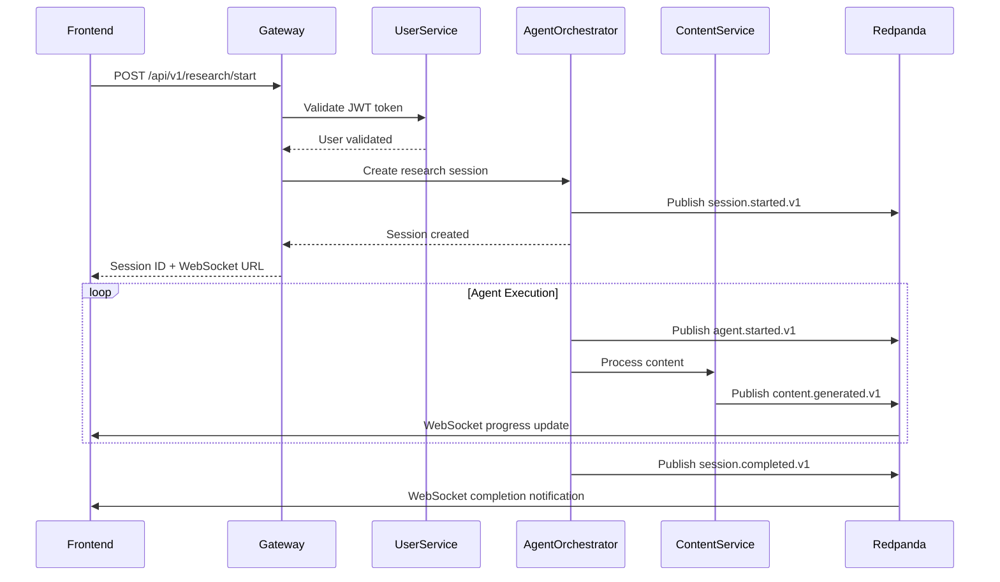
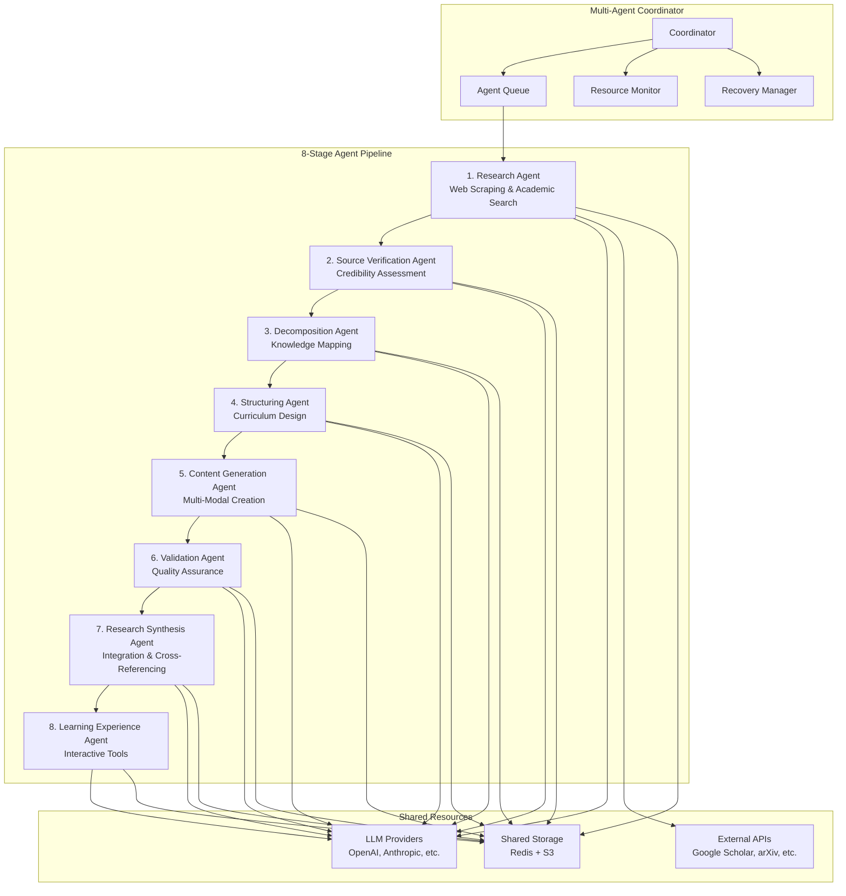
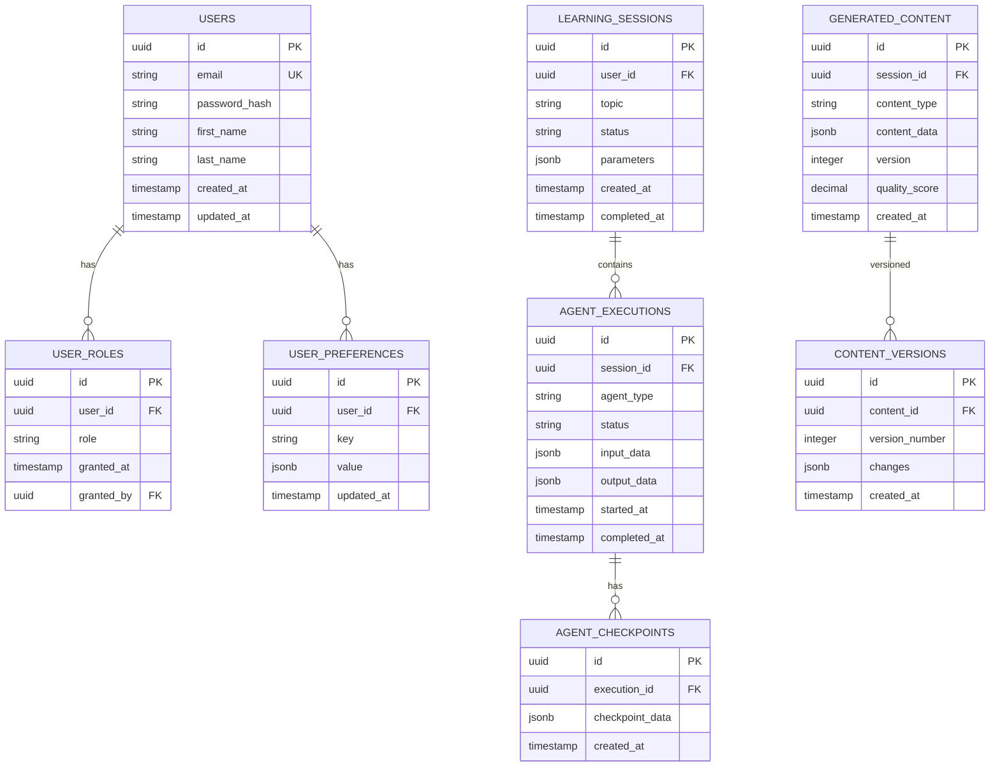
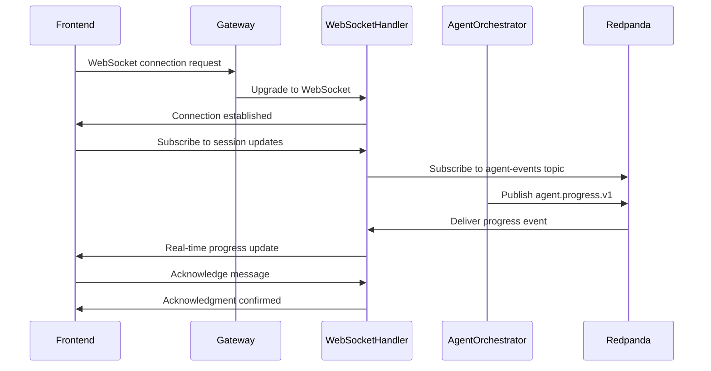
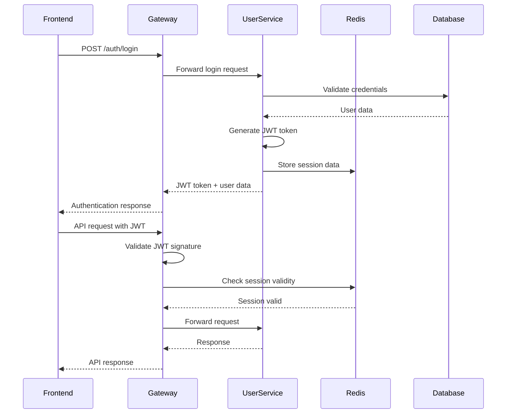
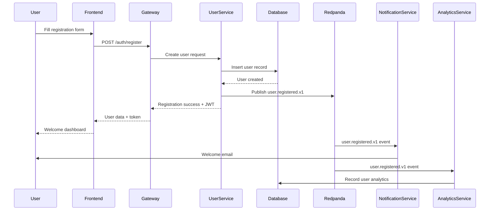
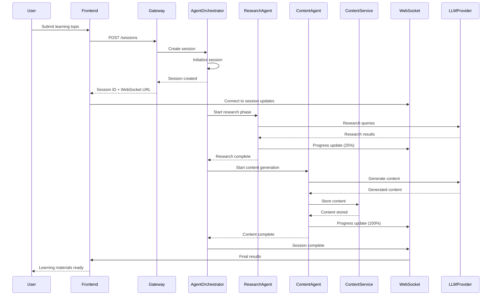

# System Design Document - Multi-Agent AI Learning Platform

## Overview

The Multi-Agent AI Learning Platform is a comprehensive educational system that transforms static learning into dynamic, personalized experiences through sophisticated AI agents, real-time collaboration, and adaptive content generation. This design document outlines the complete system architecture based on 69 comprehensive requirements.

## Architecture Overview

The platform follows a microservices architecture deployed on Kubernetes with event-driven communication through Redpanda. The system consists of three main layers:

1. **Presentation Layer**: React-based frontend with real-time WebSocket communication
2. **Application Layer**: Java Spring Boot microservices with AI agent orchestration
3. **Data Layer**: PostgreSQL databases per service with Redis caching and S3 storage

## High-Level System Architecture

```mermaid
graph TB
    subgraph "Frontend Layer"
        WEB[Web Application<br/>React + TypeScript]
        MOBILE[Mobile Apps<br/>React Native]
        PWA[Progressive Web App]
    end
    
    subgraph "API Gateway Layer"
        GATEWAY[API Gateway<br/>Spring Cloud Gateway]
        LB[Load Balancer<br/>Kubernetes Ingress]
    end
    
    subgraph "Microservices Layer"
        USER[User Service]
        AGENT[Agent Orchestrator]
        CONTENT[Content Service]
        PAYMENT[Payment Service]
        NOTIFY[Notification Service]
        ANALYTICS[Analytics Service]
        AUDIT[Audit Service]
    end
    
    subgraph "AI Agent Layer"
        COORD[Multi-Agent Coordinator]
        RESEARCH[Research Agent]
        VERIFY[Verification Agent]
        DECOMP[Decomposition Agent]
        STRUCT[Structuring Agent]
        GENERATE[Content Generation Agent]
        VALIDATE[Validation Agent]
        SYNTH[Synthesis Agent]
        LEARN[Learning Experience Agent]
    end
    
    subgraph "Data Layer"
        POSTGRES[(PostgreSQL<br/>Per Service)]
        REDIS[(Redis<br/>Cache & Sessions)]
        S3[(S3 Storage<br/>Files & Content)]
    end
    
    subgraph "Message Queue"
        REDPANDA[Redpanda Cluster<br/>Event Streaming]
    end
    
    WEB --> GATEWAY
    MOBILE --> GATEWAY
    PWA --> GATEWAY
    GATEWAY --> LB
    LB --> USER
    LB --> AGENT
    LB --> CONTENT
    LB --> PAYMENT
    LB --> NOTIFY
    LB --> ANALYTICS
    LB --> AUDIT
    
    AGENT --> COORD
    COORD --> RESEARCH
    COORD --> VERIFY
    COORD --> DECOMP
    COORD --> STRUCT
    COORD --> GENERATE
    COORD --> VALIDATE
    COORD --> SYNTH
    COORD --> LEARN
    
    USER --> POSTGRES
    AGENT --> POSTGRES
    CONTENT --> POSTGRES
    PAYMENT --> POSTGRES
    NOTIFY --> POSTGRES
    ANALYTICS --> POSTGRES
    AUDIT --> POSTGRES
    
    USER --> REDIS
    AGENT --> REDIS
    CONTENT --> REDIS
    
    CONTENT --> S3
    GENERATE --> S3
    
    USER --> REDPANDA
    AGENT --> REDPANDA
    CONTENT --> REDPANDA
    PAYMENT --> REDPANDA
    NOTIFY --> REDPANDA
    ANALYTICS --> REDPANDA
    AUDIT --> REDPANDA
```## Frontend
 Architecture

### Technology Stack
- **Framework**: React 18+ with TypeScript for type safety and modern features
- **State Management**: Redux Toolkit with RTK Query for efficient data fetching
- **UI Components**: Material-UI (MUI) v5+ with custom theming
- **Routing**: React Router v6 with protected routes and lazy loading
- **Forms**: React Hook Form with Zod validation
- **Build Tool**: Vite for fast development and optimized builds
- **Testing**: Jest, React Testing Library, and Cypress

### Component Architecture

```mermaid
graph TD
    subgraph "Frontend Application"
        APP[App Component]
        ROUTER[Router]
        AUTH[Auth Provider]
        THEME[Theme Provider]
        STORE[Redux Store]
        
        subgraph "Pages"
            LOGIN[Login Page]
            DASHBOARD[Dashboard]
            RESEARCH[Research Page]
            CONTENT[Content Viewer]
            PROFILE[Profile Page]
            ADMIN[Admin Panel]
        end
        
        subgraph "Components"
            HEADER[Header/Navigation]
            SIDEBAR[Sidebar]
            AGENT_PROGRESS[Agent Progress]
            CONTENT_VIEWER[Content Viewer]
            QUIZ[Quiz Component]
            CHAT[AI Chat Interface]
        end
        
        subgraph "Services"
            API_CLIENT[API Client]
            WS_CLIENT[WebSocket Client]
            AUTH_SERVICE[Auth Service]
            CACHE[Local Cache]
        end
    end
    
    APP --> ROUTER
    APP --> AUTH
    APP --> THEME
    APP --> STORE
    
    ROUTER --> LOGIN
    ROUTER --> DASHBOARD
    ROUTER --> RESEARCH
    ROUTER --> CONTENT
    ROUTER --> PROFILE
    ROUTER --> ADMIN
    
    DASHBOARD --> HEADER
    DASHBOARD --> SIDEBAR
    DASHBOARD --> AGENT_PROGRESS
    
    RESEARCH --> CONTENT_VIEWER
    RESEARCH --> QUIZ
    RESEARCH --> CHAT
    
    STORE --> API_CLIENT
    STORE --> WS_CLIENT
    STORE --> AUTH_SERVICE
    STORE --> CACHE
```

### State Management Architecture

```typescript
// Redux Store Structure
interface RootState {
  auth: {
    user: User | null;
    token: string | null;
    isAuthenticated: boolean;
    loading: boolean;
  };
  
  agents: {
    sessions: Record<string, AgentSession>;
    currentSession: string | null;
    progress: Record<string, AgentProgress>;
  };
  
  content: {
    generated: Record<string, GeneratedContent>;
    versions: Record<string, ContentVersion[]>;
    cache: Record<string, CachedContent>;
  };
  
  ui: {
    theme: 'light' | 'dark';
    sidebar: boolean;
    notifications: Notification[];
    modals: Record<string, boolean>;
  };
  
  realtime: {
    connected: boolean;
    connectionState: 'connecting' | 'connected' | 'disconnected' | 'error';
    subscriptions: string[];
  };
}
```## B
ackend Microservices Architecture

### Service Overview

The backend consists of 7 core microservices, each with specific responsibilities:

1. **API Gateway**: Request routing, authentication, rate limiting
2. **User Service**: User management, authentication, profiles
3. **Agent Orchestrator**: AI agent workflow coordination
4. **Content Service**: Content generation, storage, versioning
5. **Payment Service**: Subscription management, billing
6. **Notification Service**: Multi-channel notifications
7. **Analytics Service**: Usage analytics, performance metrics
8. **Audit Service**: Security logging, compliance

### Service Communication Patterns



### Microservice Specifications

#### API Gateway Service
```yaml
Service: api-gateway
Port: 8080
Dependencies:
  - User Service
  - All backend services
  
Features:
  - Request routing based on URL patterns
  - JWT token validation
  - Rate limiting (Redis-backed)
  - Request/response logging
  - Circuit breaker patterns
  - CORS handling
  
Routes:
  - /api/v1/auth/* → User Service
  - /api/v1/agents/* → Agent Orchestrator
  - /api/v1/content/* → Content Service
  - /api/v1/payments/* → Payment Service
  - /api/v1/notifications/* → Notification Service
  - /api/v1/analytics/* → Analytics Service
```

#### User Service
```yaml
Service: user-service
Port: 8081
Database: user_db (PostgreSQL)
Cache: Redis

Features:
  - User registration and authentication
  - JWT token generation and validation
  - Role-based access control (RBAC)
  - Profile management
  - Password reset functionality
  - Multi-factor authentication (TOTP)

Database Schema:
  Tables:
    - users (id, email, password_hash, created_at, updated_at)
    - user_roles (user_id, role, granted_at, granted_by)
    - user_preferences (user_id, key, value, updated_at)
    - user_sessions (id, user_id, token_hash, expires_at, created_at)
    - processed_events (event_id, processed_at)

Events Published:
  - user.registered.v1
  - user.updated.v1
  - user.role-changed.v1
  - user.deleted.v1

Events Consumed:
  - payment.subscription-activated.v1
  - payment.subscription-cancelled.v1
```#
### Agent Orchestrator Service
```yaml
Service: agent-orchestrator
Port: 8082
Database: agent_db (PostgreSQL)
Cache: Redis

Features:
  - Multi-agent workflow coordination
  - Agent lifecycle management
  - Resource allocation and monitoring
  - Checkpoint and recovery
  - Real-time progress tracking
  - LLM provider integration (BYOK)

Database Schema:
  Tables:
    - learning_sessions (id, user_id, topic, status, created_at, completed_at)
    - agent_executions (id, session_id, agent_type, status, input_data, output_data, started_at, completed_at)
    - agent_checkpoints (id, execution_id, checkpoint_data, created_at)
    - agent_configurations (id, user_id, agent_type, config_data, updated_at)
    - llm_providers (id, user_id, provider_name, encrypted_api_key, config, created_at)

Events Published:
  - session.started.v1
  - session.completed.v1
  - session.failed.v1
  - agent.started.v1
  - agent.completed.v1
  - agent.failed.v1

Events Consumed:
  - user.registered.v1
  - content.generated.v1
```

#### Content Service
```yaml
Service: content-service
Port: 8083
Database: content_db (PostgreSQL)
Storage: S3 (MinIO)

Features:
  - Generated content storage and versioning
  - Content quality scoring
  - Full-text search indexing
  - Content archival and lifecycle
  - Multi-modal content handling
  - Content delivery optimization

Database Schema:
  Tables:
    - generated_content (id, session_id, content_type, content_data, version, quality_score, created_at)
    - content_versions (id, content_id, version_number, changes, created_at)
    - content_metadata (id, content_id, metadata_key, metadata_value)
    - content_analytics (id, content_id, user_id, action, timestamp)

Events Published:
  - content.generated.v1
  - content.updated.v1
  - content.quality-scored.v1
  - content.archived.v1

Events Consumed:
  - session.started.v1
  - agent.completed.v1
```

## Multi-Agent AI System Design

### Agent Architecture Overview

The multi-agent system consists of 8 specialized agents orchestrated by a central coordinator:



### Agent Specifications

#### Research Agent (Stage 1)
```yaml
Purpose: Comprehensive information gathering from multiple sources
Resources:
  CPU: 2-4 cores
  Memory: 4-8 GB
  Timeout: 30 minutes
  
Data Sources:
  - Google Custom Search API
  - Bing Web Search API
  - Google Scholar API
  - arXiv API
  - PubMed API
  - GitHub API
  - Stack Overflow API
  
Features:
  - Parallel search execution
  - Rate limiting compliance
  - Content extraction and parsing
  - Source metadata collection
  - Relevance scoring (TF-IDF + semantic similarity)
  - Deduplication using content hashing
  
Output:
  - Structured dataset with source metadata
  - Credibility scores
  - Content summaries
  - Extraction confidence levels
```#### 
Source Verification Agent (Stage 2)
```yaml
Purpose: Assess source credibility and verify information accuracy
Resources:
  CPU: 1-2 cores
  Memory: 2-4 GB
  Timeout: 15 minutes

Credibility Tiers:
  Tier 1: .edu, .gov, peer-reviewed journals (score: 0.9-1.0)
  Tier 2: Established news outlets, professional organizations (score: 0.7-0.9)
  Tier 3: General websites, blogs (score: 0.3-0.7)

Features:
  - Domain authority assessment
  - Publication date verification
  - Author credential checking
  - Cross-reference validation
  - Conflict detection and resolution
  - Citation verification (DOI, ORCID)

Output:
  - Verified content blocks
  - Confidence scores (0.0-1.0)
  - Citation metadata
  - Credibility tier assignments
```

#### Content Generation Agent (Stage 5)
```yaml
Purpose: Create comprehensive multi-modal educational content
Resources:
  CPU: 4-8 cores
  Memory: 8-16 GB
  Timeout: 60 minutes

Content Types:
  - Structured text with proper formatting
  - Code examples with syntax highlighting
  - Mathematical formulas (LaTeX notation)
  - Mermaid diagrams for complex concepts
  - Interactive exercises and quizzes
  - Step-by-step guides and tutorials

Features:
  - Multi-format content generation
  - Accessibility compliance (WCAG 2.1)
  - Mobile-responsive formatting
  - Difficulty level adaptation
  - Learning style accommodation
  - Real-world application examples

Output:
  - Comprehensive study materials
  - Interactive learning elements
  - Assessment tools
  - Progress tracking metadata
```

## Database Design

### Database-per-Service Pattern

Each microservice maintains its own PostgreSQL database to ensure loose coupling and independent scaling:



### Database Connection Management

```yaml
Connection Pool Configuration (HikariCP):
  maximum-pool-size: 20
  minimum-idle: 5
  connection-timeout: 30000ms
  idle-timeout: 600000ms
  max-lifetime: 1800000ms
  leak-detection-threshold: 60000ms

Read Replica Configuration:
  - Primary: Write operations, real-time reads
  - Replica 1: Analytics queries, reporting
  - Replica 2: Content search, user queries

Monitoring:
  - Active connections
  - Pool utilization
  - Query execution time
  - Slow query detection (>1s)
  - Connection leak detection
```

## Message Queue Architecture (Redpanda)

### Cluster Configuration

```yaml
Redpanda Cluster:
  Brokers: 3 (minimum for production)
  Replication Factor: 3
  Min In-Sync Replicas: 2
  
Topic Configuration:
  Partitions: Based on user_id hash for ordering
  Retention: 7 days (configurable per topic)
  Compression: snappy
  Cleanup Policy: delete

Security:
  Authentication: SASL/SCRAM-SHA-256
  Encryption: TLS 1.3 for all connections
  Authorization: ACLs for topic access
```

### Event Schema Design

```json
{
  "eventType": "user.registered.v1",
  "eventId": "uuid",
  "timestamp": "2024-01-15T10:30:00Z",
  "correlationId": "uuid",
  "causationId": "uuid",
  "userId": "uuid",
  "payload": {
    "user": {
      "id": "uuid",
      "email": "user@example.com",
      "firstName": "John",
      "lastName": "Doe",
      "role": "USER"
    }
  },
  "metadata": {
    "source": "user-service",
    "version": "1.0",
    "schemaVersion": "1.0"
  }
}
```

### Topic Design

```yaml
Topics:
  user-events:
    partitions: 12
    events: [user.registered.v1, user.updated.v1, user.role-changed.v1]
    
  session-events:
    partitions: 24
    events: [session.started.v1, session.completed.v1, session.failed.v1]
    
  agent-events:
    partitions: 24
    events: [agent.started.v1, agent.completed.v1, agent.failed.v1]
    
  content-events:
    partitions: 12
    events: [content.generated.v1, content.updated.v1, content.archived.v1]
    
  payment-events:
    partitions: 6
    events: [payment.subscription-activated.v1, payment.failed.v1]
    
  system-events:
    partitions: 6
    events: [system.maintenance-started.v1, system.alert-triggered.v1]
```## Re
al-Time Communication Design

### WebSocket Architecture



### WebSocket Message Protocol

```typescript
interface WebSocketMessage {
  type: 'agent.progress' | 'agent.completed' | 'session.started' | 'system.notification';
  sessionId: string;
  timestamp: string;
  payload: any;
  correlationId: string;
  messageId: string;
  requiresAck: boolean;
}

interface WebSocketAcknowledgment {
  type: 'ack';
  messageId: string;
  timestamp: string;
}

// Connection States
type ConnectionState = 'connecting' | 'connected' | 'disconnected' | 'error' | 'reconnecting';

// Frontend WebSocket Client
class WebSocketClient {
  private connection: WebSocket;
  private reconnectAttempts: number = 0;
  private maxReconnectAttempts: number = 10;
  private reconnectDelay: number = 1000; // Start with 1 second
  
  connect(token: string): void;
  subscribe(sessionId: string): void;
  unsubscribe(sessionId: string): void;
  sendMessage(message: WebSocketMessage): void;
  handleReconnection(): void;
}
```

## Data Models

### Core Domain Models

```typescript
// User Domain
interface User {
  id: string;
  email: string;
  firstName: string;
  lastName: string;
  roles: UserRole[];
  preferences: UserPreferences;
  subscription: Subscription;
  createdAt: Date;
  updatedAt: Date;
}

interface UserRole {
  role: 'FREE_USER' | 'PRO_USER' | 'ENTERPRISE_USER' | 'ADMIN' | 'SUPER_ADMIN';
  grantedAt: Date;
  grantedBy: string;
}

// Learning Session Domain
interface LearningSession {
  id: string;
  userId: string;
  topic: string;
  status: 'PENDING' | 'IN_PROGRESS' | 'COMPLETED' | 'FAILED';
  parameters: SessionParameters;
  agentExecutions: AgentExecution[];
  generatedContent: GeneratedContent[];
  createdAt: Date;
  completedAt?: Date;
}

interface AgentExecution {
  id: string;
  sessionId: string;
  agentType: AgentType;
  status: 'PENDING' | 'RUNNING' | 'COMPLETED' | 'FAILED';
  inputData: any;
  outputData: any;
  resourceUsage: ResourceUsage;
  startedAt: Date;
  completedAt?: Date;
}

// Content Domain
interface GeneratedContent {
  id: string;
  sessionId: string;
  contentType: 'TEXT' | 'DIAGRAM' | 'QUIZ' | 'EXERCISE' | 'ASSESSMENT';
  contentData: any;
  version: number;
  qualityScore: number;
  metadata: ContentMetadata;
  createdAt: Date;
}

// Agent Configuration Domain
interface AgentConfiguration {
  id: string;
  userId: string;
  agentType: AgentType;
  llmProvider: LLMProvider;
  parameters: AgentParameters;
  updatedAt: Date;
}

interface LLMProvider {
  id: string;
  userId: string;
  providerName: 'OPENAI' | 'ANTHROPIC' | 'GOOGLE' | 'AZURE' | 'LOCAL';
  encryptedApiKey: string;
  configuration: LLMConfiguration;
  createdAt: Date;
}
```## API De
sign

### REST API Specifications

```yaml
Base URL: https://api.edusys.com/v1

Authentication:
  Type: Bearer Token (JWT)
  Header: Authorization: Bearer <token>
  Expiration: 24 hours
  Refresh: Automatic 5 minutes before expiration

Standard Response Format:
  Success:
    {
      "success": true,
      "data": { ... },
      "meta": {
        "timestamp": "2024-01-15T10:30:00Z",
        "correlationId": "uuid",
        "version": "v1"
      }
    }
  
  Error:
    {
      "success": false,
      "error": {
        "code": "VALIDATION_ERROR",
        "message": "Validation failed",
        "details": [
          {
            "field": "email",
            "code": "INVALID_FORMAT",
            "message": "Invalid email format"
          }
        ]
      },
      "meta": {
        "timestamp": "2024-01-15T10:30:00Z",
        "correlationId": "uuid",
        "version": "v1"
      }
    }
```

### Key API Endpoints

```yaml
Authentication Endpoints:
  POST /auth/register:
    body: { firstName, lastName, email, password }
    response: { user, token }
  
  POST /auth/login:
    body: { email, password }
    response: { user, token }
  
  POST /auth/refresh:
    body: { refreshToken }
    response: { token }

User Management:
  GET /users/profile:
    response: { user, preferences, subscription }
  
  PUT /users/profile:
    body: { firstName, lastName, preferences }
    response: { user }
  
  GET /users/{id}/analytics:
    response: { learningProgress, statistics }

Learning Session Management:
  POST /sessions:
    body: { topic, parameters }
    response: { session, websocketUrl }
  
  GET /sessions/{id}:
    response: { session, agentExecutions, progress }
  
  GET /sessions/{id}/content:
    response: { generatedContent, versions }
  
  DELETE /sessions/{id}:
    response: { success }

Agent Configuration:
  GET /agents/configurations:
    response: { configurations }
  
  PUT /agents/configurations/{agentType}:
    body: { llmProvider, parameters }
    response: { configuration }
  
  POST /agents/providers:
    body: { providerName, apiKey, configuration }
    response: { provider }

Content Management:
  GET /content/{id}:
    response: { content, metadata, versions }
  
  GET /content/search:
    query: { q, filters, page, limit }
    response: { results, pagination }
  
  POST /content/{id}/feedback:
    body: { rating, comments }
    response: { success }
```

## Security Architecture

### Authentication and Authorization Flow



### Security Measures

```yaml
Data Encryption:
  At Rest: AES-256 with envelope encryption
  In Transit: TLS 1.3 for all connections
  Field Level: Sensitive data (API keys, PII)

Access Control:
  Authentication: JWT with RS256 signing
  Authorization: Role-Based Access Control (RBAC)
  API Security: Rate limiting, input validation
  Network Security: Service mesh with mTLS

Secret Management:
  Storage: Kubernetes secrets / AWS Secrets Manager
  Rotation: Automatic 90-day rotation
  Access: Decryption in memory only
  Monitoring: Access logging and alerting

Compliance:
  GDPR: Data minimization, consent management, right to erasure
  SOC 2: Security controls, audit trails
  HIPAA: Healthcare data protection (if applicable)
  PCI DSS: Payment data security
```## Err
or Handling Strategy

### Circuit Breaker Pattern

```yaml
Circuit Breaker Configuration:
  Failure Threshold: 50% error rate over 20 requests
  Timeout: 60 seconds in OPEN state
  Half-Open Test Requests: 5
  
States:
  CLOSED: Normal operation, requests pass through
  OPEN: Requests fail fast, return cached/default responses
  HALF-OPEN: Limited test requests to check service recovery

Fallback Strategies:
  - Cached responses from Redis
  - Default/placeholder content
  - Graceful degradation of features
  - User notification of reduced functionality
```

### Error Categories and Handling

```typescript
enum ErrorCategory {
  TRANSIENT = 'TRANSIENT',     // Retry with backoff
  PERMANENT = 'PERMANENT',     // Fail fast, user action required
  TIMEOUT = 'TIMEOUT',         // Circuit breaker, fallback
  VALIDATION = 'VALIDATION',   // User input error
  AUTHORIZATION = 'AUTHORIZATION', // Permission denied
  RATE_LIMIT = 'RATE_LIMIT'   // Backoff and retry
}

interface ErrorResponse {
  code: string;
  message: string;
  category: ErrorCategory;
  retryable: boolean;
  retryAfter?: number;
  details?: ErrorDetail[];
}

// Retry Logic
class RetryHandler {
  private maxAttempts = 3;
  private baseDelay = 1000; // 1 second
  private maxDelay = 30000; // 30 seconds
  
  async executeWithRetry<T>(
    operation: () => Promise<T>,
    category: ErrorCategory
  ): Promise<T> {
    // Exponential backoff with jitter
    // 1s, 2s, 4s, 8s, 16s, max 30s
  }
}
```

## Performance and Scalability Design

### Horizontal Scaling Strategy

```yaml
Kubernetes Horizontal Pod Autoscaler (HPA):
  Metrics:
    - CPU utilization: 70% threshold
    - Memory utilization: 80% threshold
    - Custom metrics: Request queue length
  
  Scaling Behavior:
    Scale Up: 2 pods every 30 seconds (max)
    Scale Down: 1 pod every 60 seconds (conservative)
    Min Replicas: 2 per service
    Max Replicas: 20 per service

Database Scaling:
  Read Replicas: Auto-scaling based on read load
  Connection Pooling: Per-service optimization
  Query Optimization: Automatic index recommendations
  
Message Queue Scaling:
  Partition Scaling: Dynamic partition addition
  Consumer Scaling: Auto-scaling consumer groups
  Broker Scaling: Horizontal broker addition
```

### Caching Strategy

```yaml
Multi-Level Caching:
  L1 - Browser Cache:
    - Static assets: 1 year
    - API responses: 5 minutes
    - User preferences: 1 hour
  
  L2 - CDN Cache (CloudFlare):
    - Static content: Global edge caching
    - API responses: Regional caching
    - Dynamic content: Smart caching rules
  
  L3 - Application Cache (Redis):
    - User sessions: 24 hours
    - Generated content: 7 days
    - Agent configurations: 1 hour
    - Search results: 30 minutes
  
  L4 - Database Query Cache:
    - Frequently accessed data: 15 minutes
    - User profiles: 1 hour
    - System configurations: 4 hours

Cache Invalidation:
  - Event-driven invalidation via Redpanda
  - TTL-based expiration
  - Manual cache busting for critical updates
  - Cache warming for popular content
```

### Load Testing and Performance Benchmarks

```yaml
Performance Targets:
  API Response Time:
    - 95th percentile: < 200ms
    - 99th percentile: < 500ms
    - Average: < 100ms
  
  Agent Processing Time:
    - Research Agent: < 30 minutes
    - Content Generation: < 60 minutes
    - Total pipeline: < 2 hours
  
  Concurrent Users:
    - Target: 10,000 concurrent users
    - Peak: 50,000 concurrent users
    - Agent sessions: 1,000 concurrent
  
  Throughput:
    - API requests: 10,000 RPS
    - WebSocket messages: 50,000 messages/second
    - Database queries: 50,000 QPS
```

## Monitoring and Observability

### Metrics Collection

```yaml
Application Metrics (Prometheus):
  - Request rate, latency, error rate (RED metrics)
  - CPU, memory, disk usage (USE metrics)
  - Business metrics: sessions created, content generated
  - Custom metrics: agent execution time, quality scores

Infrastructure Metrics:
  - Kubernetes cluster health
  - Database performance
  - Message queue throughput
  - Network latency and bandwidth

Logging Strategy (ELK Stack):
  - Structured JSON logging
  - Correlation IDs for request tracing
  - Log levels: ERROR, WARN, INFO, DEBUG
  - Log retention: 30 days (configurable)

Distributed Tracing (Jaeger):
  - End-to-end request tracing
  - Agent execution tracing
  - Database query tracing
  - External API call tracing
```

### Alerting and Incident Response

```yaml
Alert Categories:
  Critical (P0):
    - Service down (>5 minutes)
    - Database connection failures
    - Payment processing failures
    - Security breaches
  
  High (P1):
    - High error rate (>5%)
    - High latency (>1 second)
    - Agent failures (>10%)
    - Memory/CPU exhaustion
  
  Medium (P2):
    - Slow queries (>5 seconds)
    - Cache miss rate high (>50%)
    - Disk space low (<20%)
  
  Low (P3):
    - Performance degradation
    - Non-critical feature failures

Notification Channels:
  - PagerDuty for critical alerts
  - Slack for high/medium alerts
  - Email for low priority alerts
  - Dashboard for all metrics
```

## Deployment Architecture

### Kubernetes Deployment

```yaml
# Namespace configuration
apiVersion: v1
kind: Namespace
metadata:
  name: learning-platform
  labels:
    name: learning-platform
    environment: production

---
# ConfigMap for application configuration
apiVersion: v1
kind: ConfigMap
metadata:
  name: app-config
  namespace: learning-platform
data:
  database.host: "postgres-cluster.database.svc.cluster.local"
  redis.host: "redis-cluster.cache.svc.cluster.local"
  redpanda.brokers: "redpanda-cluster.messaging.svc.cluster.local:9092"
  log.level: "INFO"

---
# Secret for sensitive configuration
apiVersion: v1
kind: Secret
metadata:
  name: app-secrets
  namespace: learning-platform
type: Opaque
data:
  database.password: <base64-encoded-password>
  jwt.secret: <base64-encoded-jwt-secret>
  encryption.key: <base64-encoded-encryption-key>

---
# Deployment for User Service
apiVersion: apps/v1
kind: Deployment
metadata:
  name: user-service
  namespace: learning-platform
spec:
  replicas: 3
  selector:
    matchLabels:
      app: user-service
  template:
    metadata:
      labels:
        app: user-service
        version: v1
    spec:
      containers:
      - name: user-service
        image: learning-platform/user-service:1.0.0
        ports:
        - containerPort: 8081
        env:
        - name: DATABASE_HOST
          valueFrom:
            configMapKeyRef:
              name: app-config
              key: database.host
        - name: DATABASE_PASSWORD
          valueFrom:
            secretKeyRef:
              name: app-secrets
              key: database.password
        resources:
          requests:
            cpu: 500m
            memory: 1Gi
          limits:
            cpu: 2
            memory: 4Gi
        livenessProbe:
          httpGet:
            path: /actuator/health
            port: 8081
          initialDelaySeconds: 30
          periodSeconds: 10
        readinessProbe:
          httpGet:
            path: /actuator/health/readiness
            port: 8081
          initialDelaySeconds: 5
          periodSeconds: 5

---
# Service for User Service
apiVersion: v1
kind: Service
metadata:
  name: user-service
  namespace: learning-platform
spec:
  selector:
    app: user-service
  ports:
  - port: 8081
    targetPort: 8081
  type: ClusterIP
```

### CI/CD Pipeline

```yaml
# GitHub Actions Workflow
name: CI/CD Pipeline

on:
  push:
    branches: [main, develop]
  pull_request:
    branches: [main]

jobs:
  test:
    runs-on: ubuntu-latest
    steps:
    - uses: actions/checkout@v3
    - name: Set up JDK 21
      uses: actions/setup-java@v3
      with:
        java-version: '21'
        distribution: 'temurin'
    
    - name: Run tests
      run: ./gradlew test
    
    - name: Run integration tests
      run: ./gradlew integrationTest
    
    - name: Generate test report
      uses: dorny/test-reporter@v1
      if: success() || failure()
      with:
        name: Test Results
        path: '**/build/test-results/test/TEST-*.xml'
        reporter: java-junit

  security-scan:
    runs-on: ubuntu-latest
    steps:
    - uses: actions/checkout@v3
    - name: Run security scan
      uses: securecodewarrior/github-action-add-sarif@v1
      with:
        sarif-file: security-scan-results.sarif

  build-and-deploy:
    needs: [test, security-scan]
    runs-on: ubuntu-latest
    if: github.ref == 'refs/heads/main'
    steps:
    - uses: actions/checkout@v3
    
    - name: Build Docker images
      run: |
        docker build -t learning-platform/user-service:${{ github.sha }} ./user-service
        docker build -t learning-platform/agent-orchestrator:${{ github.sha }} ./agent-orchestrator
        docker build -t learning-platform/content-service:${{ github.sha }} ./content-service
    
    - name: Push to registry
      run: |
        echo ${{ secrets.DOCKER_PASSWORD }} | docker login -u ${{ secrets.DOCKER_USERNAME }} --password-stdin
        docker push learning-platform/user-service:${{ github.sha }}
        docker push learning-platform/agent-orchestrator:${{ github.sha }}
        docker push learning-platform/content-service:${{ github.sha }}
    
    - name: Deploy to Kubernetes
      uses: azure/k8s-deploy@v1
      with:
        manifests: |
          k8s/user-service.yaml
          k8s/agent-orchestrator.yaml
          k8s/content-service.yaml
        images: |
          learning-platform/user-service:${{ github.sha }}
          learning-platform/agent-orchestrator:${{ github.sha }}
          learning-platform/content-service:${{ github.sha }}
        kubectl-version: 'latest'
```

## Data Flow Diagrams

### User Registration and Onboarding Flow



### Learning Session Creation and Execution Flow



## Implementation Roadmap

### Phase 1: Core Infrastructure (Weeks 1-4)

```yaml
Week 1-2: Foundation Setup
  - Kubernetes cluster setup
  - CI/CD pipeline configuration
  - Database setup (PostgreSQL + Redis)
  - Message queue setup (Redpanda)
  - Basic monitoring (Prometheus + Grafana)

Week 3-4: Core Services
  - API Gateway implementation
  - User Service (auth, profiles)
  - Basic frontend shell (React + TypeScript)
  - WebSocket infrastructure
  - Security implementation (JWT, RBAC)
```

### Phase 2: Agent System (Weeks 5-8)

```yaml
Week 5-6: Agent Infrastructure
  - Agent Orchestrator service
  - Base agent framework
  - LLM provider integrations
  - Agent state management and checkpointing

Week 7-8: Core Agents
  - Research Agent implementation
  - Source Verification Agent
  - Content Generation Agent
  - Agent testing and optimization
```

### Phase 3: Content and User Experience (Weeks 9-12)

```yaml
Week 9-10: Content Management
  - Content Service implementation
  - Content versioning and storage
  - Search and retrieval functionality
  - Quality scoring system

Week 11-12: User Experience
  - Complete frontend implementation
  - Real-time progress tracking
  - Interactive content viewer
  - User dashboard and analytics
```

### Phase 4: Advanced Features (Weeks 13-16)

```yaml
Week 13-14: Advanced Agents
  - Decomposition Agent
  - Structuring Agent
  - Validation Agent
  - Synthesis Agent
  - Learning Experience Agent

Week 15-16: Enterprise Features
  - Payment and subscription system
  - Advanced analytics
  - Admin panel
  - Performance optimization
```

### Phase 5: Production Readiness (Weeks 17-20)

```yaml
Week 17-18: Testing and Quality
  - Comprehensive testing suite
  - Load testing and performance tuning
  - Security auditing
  - Documentation completion

Week 19-20: Deployment and Launch
  - Production deployment
  - Monitoring and alerting setup
  - User acceptance testing
  - Go-live preparation
```

## Risk Mitigation

### Technical Risks

```yaml
LLM Provider Reliability:
  Risk: API downtime or rate limiting
  Mitigation: 
    - Multi-provider fallback system
    - Circuit breaker patterns
    - Request queuing and retry logic
    - Local model fallback options

Scalability Challenges:
  Risk: System overload during peak usage
  Mitigation:
    - Horizontal auto-scaling
    - Load testing and capacity planning
    - Caching strategies
    - Queue-based processing

Data Consistency:
  Risk: Distributed system consistency issues
  Mitigation:
    - Event sourcing patterns
    - Saga pattern for distributed transactions
    - Eventual consistency acceptance
    - Comprehensive monitoring
```

### Business Risks

```yaml
User Adoption:
  Risk: Low user engagement
  Mitigation:
    - User feedback integration
    - A/B testing for features
    - Onboarding optimization
    - Community building

Cost Management:
  Risk: High LLM usage costs
  Mitigation:
    - BYOK model (user pays directly)
    - Usage monitoring and alerts
    - Cost optimization algorithms
    - Tiered pricing model

Competition:
  Risk: Market competition
  Mitigation:
    - Unique multi-agent approach
    - Continuous innovation
    - Strong user experience
    - Community ecosystem
```

## Conclusion

This comprehensive system design provides a robust, scalable, and secure foundation for the Multi-Agent AI Learning Platform. The architecture addresses all 69 requirements through:

- **Microservices Architecture**: Ensuring scalability and maintainability
- **Event-Driven Design**: Enabling loose coupling and real-time capabilities
- **Multi-Agent System**: Providing sophisticated AI-powered learning content generation
- **Security-First Approach**: Implementing comprehensive security measures
- **Cloud-Native Deployment**: Leveraging Kubernetes for scalability and reliability

The phased implementation approach allows for iterative development and early user feedback, while the comprehensive monitoring and observability ensure system reliability and performance optimization.

This design document serves as the blueprint for building a next-generation learning platform that leverages cutting-edge AI technology to transform how people learn and acquire knowledge. CDN Cache:
    - Static content: Global distribution
    - Generated content: Regional caching
    - API responses: Edge caching
  
  L3 - Application Cache (Redis):
    - User sessions: 24 hours
    - API responses: 15 minutes
    - Database query results: 5 minutes
    - Agent configurations: 1 hour
  
  L4 - Database Cache:
    - Query result cache: PostgreSQL built-in
    - Connection pooling: HikariCP
    - Read replicas: Distributed read load
```

## Monitoring and Observability

### Metrics Collection

```yaml
Application Metrics (Prometheus):
  - HTTP request duration and count
  - Database connection pool usage
  - Message queue lag and throughput
  - Agent execution time and success rate
  - Memory and CPU usage per service
  - Custom business metrics (user registrations, sessions created)

Logging Strategy:
  Format: Structured JSON with correlation IDs
  Levels: ERROR, WARN, INFO, DEBUG
  Retention: 30 days hot, 90 days warm, 1 year cold
  
  Log Aggregation: Grafana Loki
  Log Analysis: Grafana dashboards
  Alert Rules: Prometheus Alertmanager

Distributed Tracing:
  Tool: Jaeger
  Sampling: 1% for normal traffic, 100% for errors
  Trace Context: Propagated via HTTP headers and Redpanda messages
  Correlation: Request ID tracking across all services
```

### Health Checks and Monitoring

```yaml
Health Check Endpoints:
  /actuator/health: Overall service health
  /actuator/health/readiness: Ready to receive traffic
  /actuator/health/liveness: Service is alive
  
Health Check Components:
  - Database connectivity
  - Redis connectivity
  - Redpanda connectivity
  - External API availability
  - Disk space and memory usage

Alerting Rules:
  Critical:
    - Service down for >2 minutes
    - Database connection failures
    - Message queue lag >1000 messages
    - Error rate >5% for >5 minutes
  
  Warning:
    - High memory usage >80%
    - High CPU usage >70%
    - Slow response times >2 seconds
    - Agent execution failures >10%
```

## Testing Strategy

### Testing Pyramid

```yaml
Unit Tests (70%):
  - Individual component testing
  - Business logic validation
  - Mock external dependencies
  - Target: 80%+ code coverage
  
Integration Tests (20%):
  - Service-to-service communication
  - Database integration
  - Message queue integration
  - Testcontainers for infrastructure
  
End-to-End Tests (10%):
  - Complete user journeys
  - Cross-service workflows
  - Real browser testing with Cypress
  - Performance validation
```

### Test Environment Strategy

```yaml
Environments:
  Development:
    - Local Docker Compose
    - In-memory databases for fast testing
    - Mock external services
  
  Staging:
    - Production-like infrastructure
    - Real external service integrations
    - Performance testing
    - Security testing
  
  Production:
    - Blue-green deployments
    - Canary releases
    - Real-time monitoring
    - Automated rollback on failures
```

This design document provides a comprehensive architecture for the multi-agent AI learning platform, addressing all 69 requirements with detailed specifications for implementation.